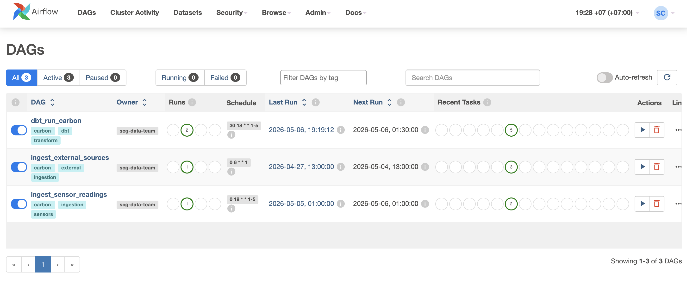
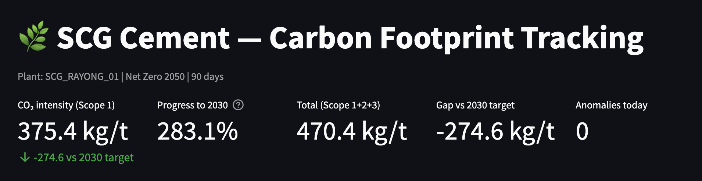
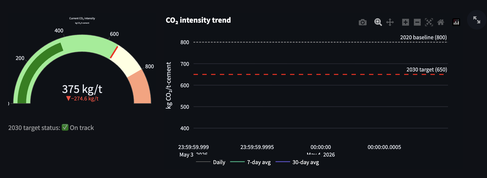
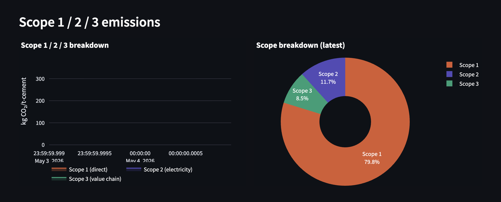
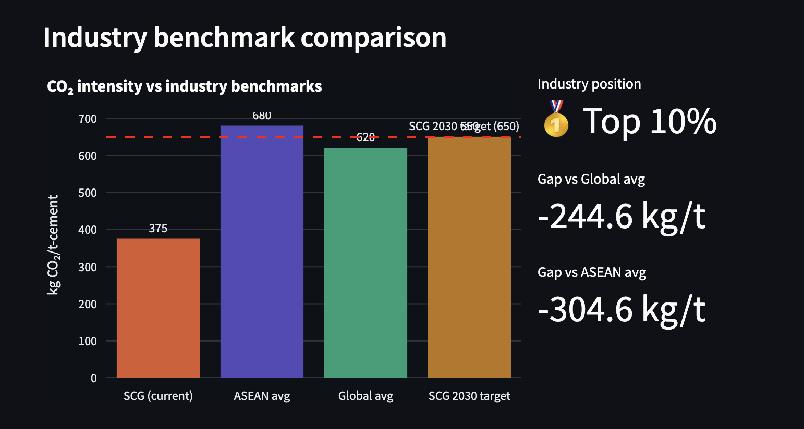

# SCG Carbon Footprint Tracking Platform

> **Industrial Data Engineering Portfolio Project**
> Batch pipeline สำหรับติดตาม carbon footprint และ Net Zero 2050 progress ของโรงงานปูนซีเมนต์ SCG Rayong

[](https://airflow.apache.org/)
[](https://www.getdbt.com/)
[](https://www.postgresql.org/)
[](https://www.python.org/)

---

## About

โปรเจคนี้สร้าง **end-to-end batch data pipeline** สำหรับติดตาม carbon emissions ของโรงงานปูนซีเมนต์ โดยรวมข้อมูลจากหลาย sources เข้าด้วยกัน transform ด้วย dbt และแสดงผลผ่าน Streamlit dashboard

### สิ่งที่ระบบทำได้

| ความสามารถ | รายละเอียด |
|-----------|-----------|
| **Multi-source ingestion** | ดึงข้อมูลจาก 3 sources: sensor data, Our World in Data CO₂, IEA benchmarks, OpenAQ |
| **Batch orchestration** | Airflow 3 DAGs รันอัตโนมัติ — sensor daily, external weekly, dbt trigger |
| **dbt transform** | staging → intermediate → marts พร้อม data quality tests 16 รายการ |
| **Scope 1/2/3 emissions** | คำนวณ carbon emissions ครบทั้ง 3 scopes ตาม GHG Protocol |
| **Net Zero tracking** | เปรียบเทียบ CO₂ intensity vs SCG target 2030 (650 kg/t) และ 2050 |
| **Industry benchmark** | เทียบกับ IEA Global (620 kg/t) และ ASEAN (680 kg/t) average |
| **AI-ready export** | Export mart tables เป็น Parquet สำหรับ ML model |
| **dbt docs** | Data lineage + catalog generate อัตโนมัติทุก run |

---

## Architecture

```
External Sources                    Sensor Data
 ├── Our World in Data (CO₂)         └── Kiln simulator
 ├── IEA (cement benchmarks)              (7 carbon-related sensors)
 └── OpenAQ (air quality)
          │                                    │
          ▼ Airflow DAG                        ▼ Airflow DAG
   ingest_external_sources           ingest_sensor_readings
   (ทุกวันจันทร์ 06:00)              (ทุกวัน 18:00 จันทร์-ศุกร์)
          │                                    │
          └──────────────┬─────────────────────┘
                         ▼
                    PostgreSQL
                  (raw tables)
                         │
                         ▼ TriggerDagRunOperator
                  dbt_run_carbon
                  ├── dbt deps
                  ├── dbt run (staging → intermediate → marts)
                  ├── dbt test (16 quality tests)
                  ├── dbt docs (generate catalog)
                  └── export Parquet
                         │
              ┌──────────┴──────────┐
              ▼                     ▼
     Streamlit dashboard      Parquet files
     (Net Zero KPI tracker)   (ML-ready export)
```

---

## dbt Data Model

```
models/
├── staging/
│   ├── stg_sensor_readings.sql    ← clean + unit conversion (→ kg CO₂/t)
│   ├── stg_owid_emissions.sql     ← CO₂ emissions by country
│   └── stg_iea_benchmarks.sql     ← industry benchmarks (pivot)
│
├── intermediate/
│   ├── int_scope1_emissions.sql   ← direct emissions (kiln combustion)
│   ├── int_scope2_emissions.sql   ← electricity (grid emission factor)
│   └── int_scope3_emissions.sql   ← value chain (upstream + downstream)
│
└── marts/
    ├── mart_co2_intensity.sql     ← KPI: CO₂ intensity Scope 1+2+3
    ├── mart_net_zero_progress.sql ← progress vs 2030/2050 targets
    └── mart_benchmark_gap.sql     ← gap vs IEA Global/ASEAN benchmarks
```

---

## Tech Stack

| Layer | Tool | เหตุผลที่เลือก |
|-------|------|----------------|
| Orchestration | Apache Airflow 2.8 | batch scheduling + DAG dependencies |
| Transform | dbt-postgres 1.7 | SQL transform, tests, lineage, docs |
| Storage | PostgreSQL 15 | relational + JSON support |
| Dashboard | Streamlit | rapid data app development |
| Data sources | OWID, IEA, OpenAQ | free open datasets |
| Infra | Docker Compose | single command, reproducible |

---

## Project Structure

```
carbon-platform/
│
├── docker-compose.yml              # orchestrate ทุก service
├── Dockerfile.airflow              # custom Airflow + dbt-postgres
├── Dockerfile.dashboard            # Streamlit image
├── requirements.dashboard.txt      # dashboard dependencies
├── .env.example                    # environment variables template
│
├── init-db/
│   └── 01_schema.sql               # raw tables: sensor, owid, iea, openaq, pipeline_log
│
├── dags/
│   ├── dag_ingest_sensors.py       # daily sensor ingestion + trigger dbt
│   ├── dag_ingest_external.py      # weekly OWID + IEA + OpenAQ ingestion
│   └── dag_dbt_run.py              # dbt run + test + docs + export Parquet
│
├── dbt_carbon/
│   ├── dbt_project.yml             # dbt config + Net Zero target vars
│   ├── profiles.yml.example        # DB connection template
│   ├── models/
│   │   ├── sources.yml             # source definitions + freshness checks
│   │   ├── staging/                # 3 staging models
│   │   ├── intermediate/           # Scope 1/2/3 calculations
│   │   └── marts/                  # 3 mart models (AI-ready KPIs)
│   └── tests/
│       ├── co2_not_negative.sql    # CO₂ ต้องไม่ติดลบ
│       └── intensity_reasonable_range.sql
│
├── dashboard/
│   └── app.py                      # Streamlit Net Zero KPI dashboard
│
└── exports/                        # Parquet output สำหรับ ML team
```

---

## Quick Start

**Prerequisites:** Docker Desktop

```bash
# 1. Clone และ setup
git clone https://github.com/YOUR_USERNAME/carbon-platform.git
cd carbon-platform

cp .env.example .env
# แก้ค่าใน .env
# CARBON_DB_USER=your_user
# CARBON_DB_PASS=your_password
# AIRFLOW_ADMIN_PASS=your_password

cp dbt_carbon/profiles.yml.example dbt_carbon/profiles.yml

# 2. รัน (ครั้งแรก build image ~5 นาที)
docker compose up -d --build
```

รอ ~5 นาที แล้วเปิด:

| Service | URL | หมายเหตุ |
|---------|-----|---------|
| Airflow UI | http://localhost:8080 | admin / ค่าใน .env |
| Streamlit dashboard | http://localhost:8501 | Net Zero KPI tracker |

```bash
# 3. Trigger DAGs ตามลำดับ
# Airflow UI → DAGs → กด ▶️ trigger ตามลำดับ

# 1) ingest_external_sources  ← OWID + IEA + OpenAQ
# 2) ingest_sensor_readings   ← sensor data (dbt จะ trigger อัตโนมัติ)

# หรือ command line
docker exec -it carbon_airflow_web \
  airflow dags trigger ingest_external_sources

docker exec -it carbon_airflow_web \
  airflow dags trigger ingest_sensor_readings
```

---

## DAG Overview

| DAG | Schedule | หน้าที่ |
|-----|----------|---------|
| `ingest_external_sources` | ทุกจันทร์ 06:00 | ดึง OWID CO₂ + IEA benchmarks + OpenAQ |
| `ingest_sensor_readings` | ทุกวัน 18:00 (จ-ศ) | ดึง sensor data → trigger dbt อัตโนมัติ |
| `dbt_run_carbon` | triggered by sensors | dbt run → test → docs → export Parquet |

---

## Data Quality

dbt tests 16 รายการรันอัตโนมัติทุก pipeline run:

| Test | Model | ตรวจอะไร |
|------|-------|---------|
| `not_null` | ทุก model | key columns ต้องไม่ว่าง |
| `source freshness` | raw tables | data ต้องไม่เก่าเกิน 5 วัน |
| `co2_not_negative` | mart_co2_intensity | CO₂ ต้องไม่ติดลบ |
| `intensity_reasonable_range` | mart_co2_intensity | 200-1,200 kg CO₂/t-cement |

---

## Net Zero KPIs

| KPI | Target | 2020 Baseline |
|-----|--------|---------------|
| CO₂ intensity (Scope 1) | 650 kg/t-cement (2030) | 800 kg/t-cement |
| CO₂ intensity (Net Zero) | 0 kg/t-cement (2050) | — |
| vs IEA Global avg | < 620 kg/t-cement | — |
| vs IEA ASEAN avg | < 680 kg/t-cement | — |

---

## Useful Commands

```bash
# ดู pipeline logs
docker compose logs airflow-scheduler --tail=30
docker compose logs dashboard --tail=20

# ตรวจสอบ dbt tables ใน PostgreSQL
docker exec -it carbon_postgres psql -U $CARBON_DB_USER -d carbondb -c \
  "SELECT schemaname, tablename FROM pg_tables WHERE schemaname LIKE 'public%' ORDER BY 1,2;"

# รัน dbt manually
docker exec -it carbon_airflow_scheduler bash -c \
  "cd /opt/airflow/dbt_carbon && dbt run --profiles-dir . --target airflow"

# Export Parquet manually
docker exec -it carbon_airflow_web \
  airflow dags trigger dbt_run_carbon

# Reset ทุกอย่าง
docker compose down -v
```

---

## JD Alignment — SCG Data Engineer

| JD Requirement | Implementation |
|---------------|----------------|
| Develop and maintain data pipelines | 3 Airflow DAGs + dbt transform layer |
| Structure and manage industrial data | raw → staging → intermediate → marts |
| Integrate data from multiple sources | sensor + OWID + IEA + OpenAQ (4 sources) |
| Ensure data quality and reliability | dbt tests 16 รายการ + source freshness |
| Prepare datasets for AI applications | Parquet export + mart_co2_intensity |
| Document data structures and pipelines | dbt docs lineage + README |

---

## Screenshots

### Airflow — 3 DAGs พร้อม schedule


### Dashboard — Net Zero KPI summary


### Dashboard — CO₂ intensity gauge + trend


### Dashboard — Scope 1 / 2 / 3 breakdown


### Dashboard — Industry benchmark comparison


'''

---

*Built for SCG Data Engineer portfolio — Batch Pipeline + dbt + Airflow + Net Zero 2050*